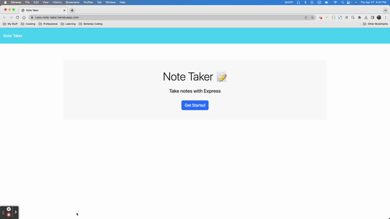

   # Note Taker 

    

   
   
   
   ## Table of Contents
   
   - [**Description**](#📑-description)
   - [**Installation**](#💾-installation)
   - [**Usage**](#💻-usage)
   - [**Questions**](#❓-questions)
   
   ## 📑 Description 
   Note taking web application is simple and easy to use. The user simply needs to visit the link below, click "Get Started" and they are taken to a page with any notes they have previously saved. User simply adds a title, then clicks the save button and the note is posted to the left hand side for future review. 
   
   [Live Site Link](https://cass-note-taker.herokuapp.com/)

   ## 💻 Usage
   The application can be accessed from any web browser. Users can store as many notes as they would like and review them easily. 

   

  ## ❓ Questions 
   
   🖐 My name is Cassie! If you have any question about me or the project, feel free to contact me:

   
     - Github: [CTep09](https://github.com/CTep09)

     - Email: [CassandraY9@gmail.com](mailto:cassandray9@gmail.com)
   
